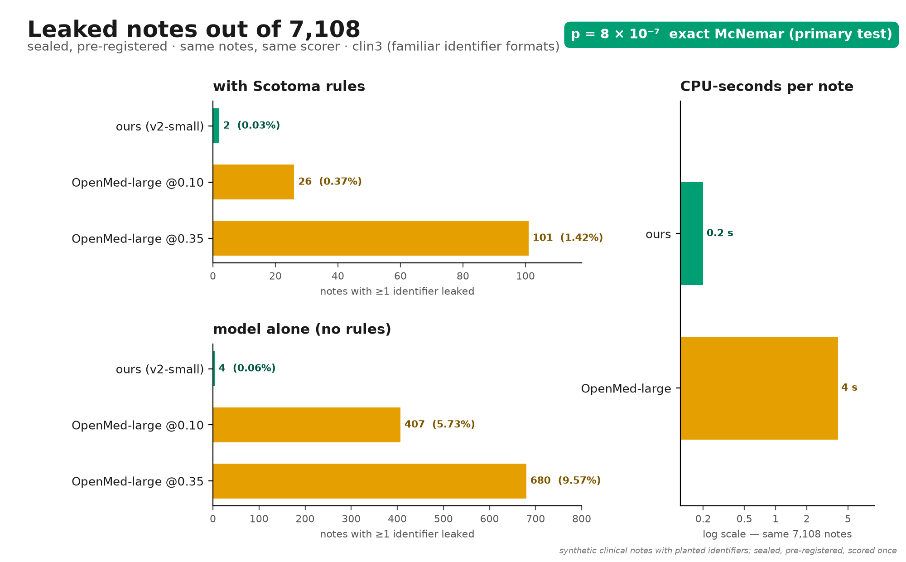
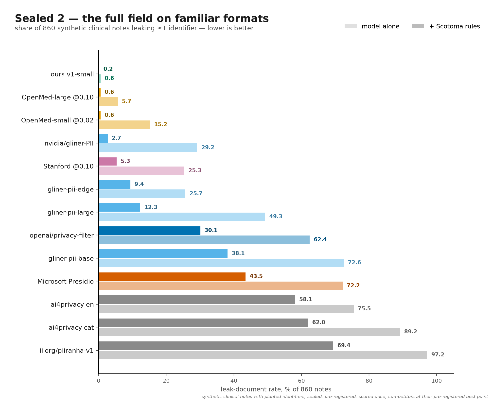
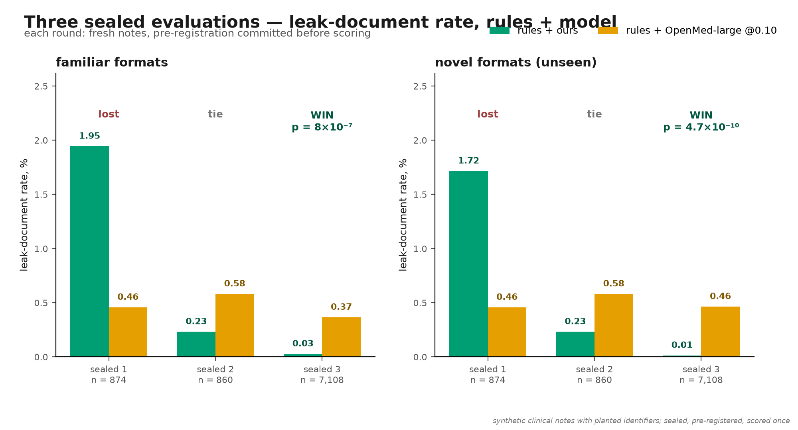
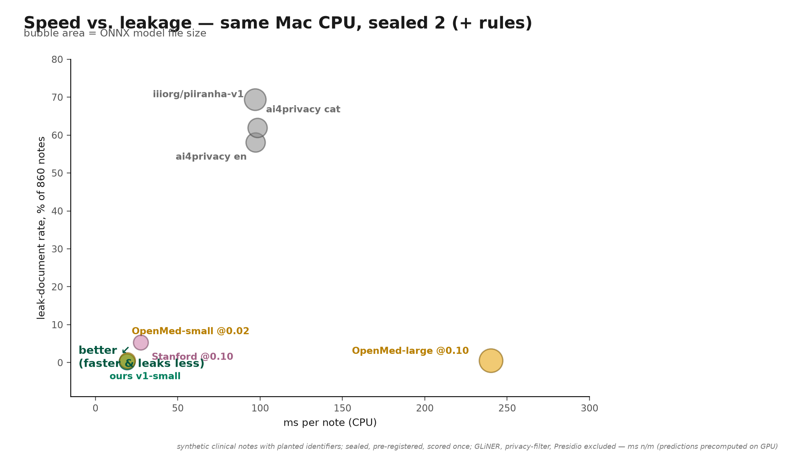
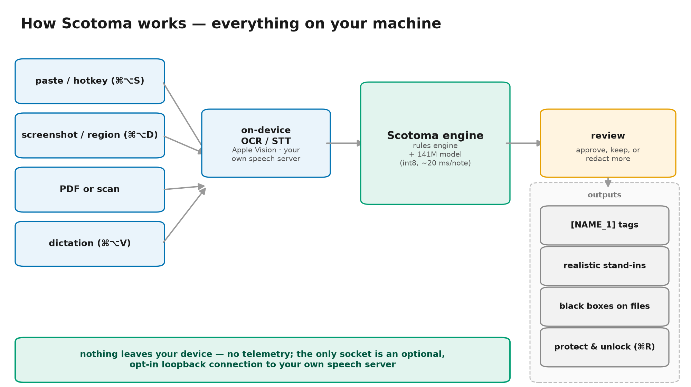

# Scotoma

An on-device scrubber for patient identifiers. Copy part of a clinical note, press a hotkey, check
what was caught, paste. Then paste the reply back and press another hotkey to put the real names
back in.

It is a Tauri desktop app (macOS tested; Linux builds) around a Rust core: a deterministic rules
engine for structured identifiers plus a DeBERTa-v3-small token classifier (141 M params, per-channel
int8 ONNX, 172 MB, ~20 ms per note on a laptop CPU). Nothing leaves the machine — the only socket
the app ever opens is an optional, opt-in loopback connection to your own speech server.

Apache-2.0. See [NOTICE](NOTICE) for the data and model credits.

<p align="center"></p>

## Benchmark headline

Measured on **sealed** planted-identifier clinical sets — scored exactly once under a committed
pre-registration, metric = share of notes with ≥1 identifier left untouched (lower is better),
constraint = over-redaction ≤ 1 %. Full tables, method, verdicts and reproduction commands:
[docs/BENCHMARK.md](docs/BENCHMARK.md) · raw files [bench/results/](bench/results/).

Sealed 3, 7,108 notes per set, 2026-10-05 — the powered head-to-head against the strongest
open model, pre-registered before scoring ([SEALED3_RESULTS.md](bench/results/SEALED3_RESULTS.md)):

| system (clin3, familiar formats) | notes with a leak | over-redaction | ms/note (CPU) |
|---|---|---|---|
| **rules + Scotoma v2-small** (int8 @0.02) | **2 / 7,108 (0.03 %)** | 0.2 % | ~20 |
| rules + OpenMed-PII-SuperClinical-Large-434M (fp32) @0.10 | 26 / 7,108 (0.37 %) | 0.5 % | ~240 |

**Significant win**: exact two-sided McNemar p = 8.0 × 10⁻⁷ (discordant notes 1 vs 25),
bootstrap difference +0.3 pp [+0.2, +0.5]. On unseen identifier formats (clin3_novel):
1 leaked note (0.01 %) vs 33 (0.46 %), p = 4.7 × 10⁻¹⁰. Every secondary comparison is also a
win (p ≤ 8.0 × 10⁻²⁹). Per-note compute: ~0.2 vs ~4 CPU-seconds — roughly 1/20.
Caveats: only OpenMed-large was in this powered run; the full field is below; all notes are
synthetic.

The full field — sealed 2, 860 notes per set, 2026-10-05, model v1-small
([SEALED2_RESULTS.md](bench/results/SEALED2_RESULTS.md)):

| system | model alone, familiar | model alone, novel formats | + our rules, familiar | + our rules, novel | ms/note (CPU) |
|---|---|---|---|---|---|
| **Scotoma v1-small** (int8 @0.02) | 0.6 % | 2.6 % | **0.2 %** | **0.2 %** | **19–20** |
| OpenMed-PII-SuperClinical-Large-434M @0.10 | 5.7 % | 3.3 % | 0.6 % | 0.6 % | 240–255 |
| OpenMed-PII-SuperClinical-Small-44M @0.02 | 15.2 % | 5.3 % | 0.6 % | 1.7 % | 19 |
| StanfordAIMI/stanford-deidentifier @0.10 | 25.3 % | 25.1 % | 5.3 % | 5.0 % | 27–29 |
| nvidia/gliner-PII | 29.2 % | 25.6 % | 2.7 % | 3.8 % | n/m |
| openai/privacy-filter | 62.4 % | 65.3 % | 30.1 % | 29.1 % | n/m |
| Microsoft Presidio | 72.2 % | 74.9 % | 43.5 % | 53.6 % | n/m |
| iiiorg/piiranha-v1 | 97.2 % | 97.3 % | 69.4 % | 76.4 % | 91–96 |
| rules only | 95.9 % | 96.9 % | — | — | 0.1 |

<p align="center"></p>

Verdicts (paired bootstrap 95 % CI): significant wins over every competitor except
OpenMed-large @0.10 + rules — then a statistical tie (2 vs 5 leaked notes), since resolved by
the powered sealed-3 win above — and OpenMed-small @0.02 + rules on familiar formats (tie).
The currently bundled model is **v2-small** (sha256 `33be2438…87e41`).

Honest history: in sealed 1 the same OpenMed-large configuration **beat** our v0 model (0.5 %
vs 1.9 % / 1.7 %). [Details](docs/BENCHMARK.md#sealed-1--final-874-notes-per-set-model-scotoma-v0-int8-002).

<p align="center">
&nbsp;

</p>

## Install and run

Needs Rust, Node, and Python for the model export. On Linux also the Tauri system packages
(`libwebkit2gtk-4.1-dev`, `libayatana-appindicator3-dev`, `librsvg2-dev`, `libxdo-dev`).

```sh
pip install torch "transformers>=4.57,<5" onnx onnxruntime
python scripts/fetch_model.py          # exports + int8-quantises a model into app/src-tauri/models/default
cd app && npm install
npm run dev                            # or: npm run build → installers in target/release/bundle
```

Without a model folder the app runs on rules alone and says so in the header. The CLI:

```sh
cargo run --release -p scotoma -- scrub < note.txt          # redact to stdout
cargo run --release -p scotoma -- eval eval/fixtures/clinical_smoke.jsonl --no-model
cargo run --release -p scotoma -- sweep eval/fixtures/clinical_smoke.jsonl --model models/v2-small
```

## How it works

<p align="center"></p>

- **Two detectors, merged.** A deterministic rules engine catches structured identifiers
  (MRNs, SSNs, dates, ZIPs, phone, email); a token classifier catches names and anything else the
  rules don't know. Labels are mapped by keyword, so most Hugging Face PII models work by dropping
  a folder in.
- **Review before paste.** The hotkey opens a side-by-side view. Click a highlight to keep it in,
  select text to redact something missed. Sub-threshold model hits show dashed as "possible"
  instead of being silently dropped. Nothing reaches the clipboard until you approve (or turn
  review off for one-keystroke use).
- **Reversible.** `[NAME_1]`, `[DATE_2:2024]` tags, or realistic stand-ins (consistent fake names,
  555-01xx phone numbers, dates shifted by one per-session offset so intervals survive). `⌘⌥R`
  restores originals in whatever is on the clipboard. The map lives in memory only, is zeroed on
  quit, on "forget", and after 30 idle minutes.
- **Safe Harbor details.** Dates keep only the year; a birth year implying age 90+ is dropped;
  ages over 89 become `90+`; ZIP keeps three digits, and the 17 sparse ZIP3 prefixes become `000`.
- **Name propagation.** Once "Eleanor Whitfield" is found, bare "Whitfield" and "Karen Whitfield"
  further down are caught too.
- **Recall-leaning decode.** Per-token identifier probability is summed over B-/I- variants and
  thresholded (clinical point 0.02, stored in the model's config as `scotoma_threshold`) rather
  than argmax. Long notes run in overlapping windows; nothing is truncated.
- **Measured.** `scotoma eval` scores the exact shipped pipeline per identifier type, and
  `scotoma sweep` shows recall against precision by threshold.

### Inputs (macOS overlay)

The window is a floating overlay: it appears over whatever you are doing, `esc` hides it, and it
hides itself after **Copy cleaned text** so the paste lands where you were.

| Input | Trigger | How the text is obtained |
|---|---|---|
| Selected text | `⌘⌥S` | Accessibility API; falls back to pressing ⌘C for you and then restoring your clipboard |
| Clipboard text or screenshot | `⌘⌥S` with nothing selected | Clipboard; an image is read with on-device OCR |
| Screen region | `⌘⌥D` or **Capture** | Native crosshair → clipboard → Apple Vision OCR |
| Voice, your model | `⌘⌥V` to start, again to stop, or **Dictate** | Records 16 kHz mono WAV, sends it to your speech model |
| Voice, Superwhisper | `⌘⌥N`, then dictate | Opens the overlay empty and focused; anything that types into a field lands in it |
| Blank note | `⌘⌥N` | Fresh overlay |

**Speech model.** Set it in the side panel. Fastest is a server that keeps the model loaded:
`http://127.0.0.1:8080/inference` (whisper.cpp `whisper-server`) or any OpenAI-style
`/v1/audio/transcriptions` endpoint (add `#model=NAME` if it needs one). Only loopback addresses
are accepted. Alternatively give a shell command that prints the transcript, with `{audio}` for
the file — for example `whisper-cli -m ~/models/ggml-large-v3-turbo.bin -nt -np -f {audio}` —
but that reloads the model on every utterance. The recording is the one thing that touches disk
(a temp file, deleted straight after transcription). The speech server connection is the only
socket the app ever opens. If you dictate with Superwhisper, use a local voice model with no
cloud post-processing: otherwise the audio has left the machine before Scotoma sees a word.

**Latency.** The footer of the left pane shows where the time went for each input, for example
`screen · read 240 ms · detect 35 ms`. The detection model is warmed at startup.

**Permissions** (System Settings → Privacy & Security): Screen Recording for capture,
Accessibility for reading the selection, Microphone for dictation. The app does not listen to
the keyboard; it only registers its own hotkeys, so no Input Monitoring permission is needed.
When launched with `npm run dev` the prompts name your terminal app rather than Scotoma.

The capture helper is `app/src-tauri/helper/main.swift`, compiled by the build (needs the Xcode
command line tools); not available on Windows or Linux yet.

## How it is evaluated

Everything is in [docs/BENCHMARK.md](docs/BENCHMARK.md). In short: identifier values are planted
first (test-only pool, disjoint from all training pools), an LLM from a *different family than
the training-data generator* writes notes around the placeholders, and a fail-closed verifier
substitutes the values — so labels are exact by construction and any note with stray
identifier-looking text is rejected. "Novel-format" sets re-draw the structured identifiers from
56 test-only formats never used in training. Every system is scored through the same
`scotoma eval` pipeline, alone and with our rules engine. Sealed sets are scored once, under a
committed pre-registration; significance is a paired bootstrap / exact McNemar on per-note leaks.

## The model

| | |
|---|---|
| Architecture | `microsoft/deberta-v3-small` fine-tuned for token classification, 141 M params (98 M embedding) |
| Shipped format | 8-bit per-channel ONNX (`model_quantized.onnx`), 172 MB |
| Threshold | 0.02 (clinical operating point, in `config.json` as `scotoma_threshold`) |
| Latency | ~20 ms per note, M3 Max CPU |
| Training data | 50 k NVIDIA Nemotron-PII docs (CC BY 4.0) + 30 k synthetic template docs + 12,273 clinical notes written by Qwen/Qwen3-14B-AWQ around planted fake identifiers — 3 epochs |
| Model card | `release/hf/` (Hugging Face release assets) |

Other HF token-classification PII models drop in as a folder (`scripts/fetch_model.py --model …`).
Previously benchmarked: OpenMed-PII-SuperClinical-Small-44M (Apache-2.0), stanford-deidentifier
(MIT), obi/deid_roberta_i2b2 (MIT), openai/privacy-filter (Apache-2.0, ~810 MB smallest ONNX).

## Layout

```
crates/core   detection, merge, redaction, vault, benchmark   (no network code)
crates/cli    scotoma scrub | eval | sweep | evalmany
app/          Tauri 2 desktop app: tray, global hotkeys, review window (plain HTML/JS)
scripts/      fetch_model.py, prep_dataset.py, markup_to_jsonl.py, make_toy_model.py
eval/         fixtures/clinical_smoke.{markup,jsonl}
domains/      what each field's regulations name as identifying (clinical, tax, legal, hr, education)
bench/        generate.py, plant_generate.py, verify_planted.py, run.py, battery.py, formats.py
train/        train.py (fine-tune + ONNX export), ingest_formats.py, colab.ipynb
docs/         BENCHMARK.md — full method, all tables, reproduction
bench/results/ every scorecard, pre-registration, and run log
```

## Limits

- **It can miss things.** Rules cover formats, the model covers language, and neither reads
  minds: a rare-disease mention or "the mayor's wife" identifies someone without containing an
  identifier. Scotoma is a helper, not a guarantee — read the right-hand pane before pasting.
- **All benchmark text is synthetic.** Labels are exact by construction, but the prose is
  LLM-written. A real-clinical-text benchmark (i2b2/n2c2) has not been run yet.
- Familiar-format test sets share identifier *formats* with our training-family generator code
  (values are disjoint); the novel-format sets exist to control for this.
- The powered sealed-3 win is against **one competitor** (OpenMed-large, the closest on
  sealed 2); the other 12 systems were compared on the smaller sealed-2 sets.
- macOS is the tested platform (hotkeys, capture, OCR, dictation). The Rust core and CLI build
  on Linux; the overlay helper is macOS-only. Windows untested.
- Known false positives exist — e.g. the eponym "Babinski sign" can be flagged as a name.
- Stand-in restore only works where the stand-in survives verbatim in the reply; tags are sturdier.
- The domain policy files are a reading of the cited regulations, not legal advice.

## Available for work

The author is available for paid work: custom de-identification for your organisation's document
types and identifier formats, new domains beyond clinical, on-device ML deployment, and benchmark
design. Contact: **{{CONTACT}}**.
