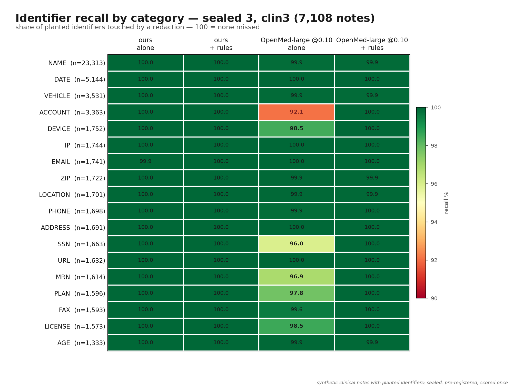

# Scotoma benchmark

How Scotoma is measured, every number we publish, and how to reproduce each one.
All raw artefacts live in [`bench/results/`](../bench/results/); every table here
says which file it was copied from.

Sealed 3 (7,108 notes per set, model `scotoma-small`) is final as of 2026-10-05 and
is the headline result; sealed 2 (860 notes per set, model `v1-small`) remains
below as the full field comparison.

## TL;DR

- Metric: **leak-document rate** — the share of notes with at least one
  identifier left untouched. Lower is better.
- Constraint: **over-redaction ≤ 1 %** — the share of ordinary text redacted by
  mistake. A system that blacks out everything has perfect recall, so we never
  report leak rate without it.
- Sealed 3 (final): our shipped configuration (`scotoma-small` + rules) leaked
  **2 of 7,108 notes (0.03 %)** vs 26 (0.37 %) for rules +
  OpenMed-PII-SuperClinical-Large (fp32) at its best pre-registered threshold —
  a **significant win** (exact McNemar p = 8.0 × 10⁻⁷) at about **1/20 the CPU
  compute** (~20 ms vs ~240 ms per note on a laptop).
- Sealed 2 (final): our then-shipped configuration leaked **0.2 %** of notes on
  both sets — the fewest of every system tested, statistically tied with
  OpenMed-large (fp32, + our rules) at its best threshold, at about **12× lower
  CPU latency**.
- All test text is **synthetic** (LLM-written notes with planted fake
  identifiers). Nothing here is a claim about real clinical text yet — see
  [Limits](#limits).

## Method

### The test sets

Clinical notes written by an LLM around identifiers that were chosen **before**
the text existed:

1. `bench/plant_generate.py spec --n N --seed S` picks every identifier value in
   advance from **universe C**, a test-only pool of names, streets, cities,
   organisations and mail hosts disjoint from the template generator's train
   (A) and test (B) pools (the disjointness is asserted at import). The output
   is a spec of placeholders + values, byte-identical on rerun.
2. An LLM writes each note around typed placeholders (`[[NAME_1]]`,
   `[[MRN_1]]`, …) and never sees a real value. Generator:
   `RedHatAI/diffusiongemma-26B-A4B-it-FP8-dynamic` (Apache-2.0) on vLLM — a
   different model family from `Qwen/Qwen3-14B-AWQ`, which wrote the planted
   *training* notes.
3. `bench/verify_planted.py` substitutes the values, so every label offset is
   exact by construction, then rejects any note with a missing or unknown
   placeholder, too few repeats, or anything that looks like an identifier the
   LLM invented on its own (unplanted digits, dates, emails, URLs, pool names,
   institution names, rules-engine hits). Verification is deterministic;
   re-running it on the raw file gives byte-identical output.
4. **Novel-format variants**: `bench/build_novel.py` re-draws the structured
   identifiers (MRNs, account numbers, plan IDs, …) from the test split of
   `bench/formats.py` — 56 formats never used in training and unreachable from
   the training path. This controls for the fact that the familiar-format sets
   share format code with our template training data.

Because the labels are planted and substituted mechanically, there is no human
annotation noise in the ground truth: an identifier is either redacted or
leaked, exactly.

### Sealed-set rules

- A sealed set is scored **exactly once**. Before each run we commit a
  pre-registration (`bench/results/SEALED*_PREREG.md`) fixing the model, its
  sha256, the systems, their operating points, the primary metric and the
  claim rule. The run is logged in `bench/results/SEALED*_LOG.md`.
- Models and thresholds are chosen on **dev** sets only. `bench/battery.py`
  refuses any path containing `sealed` (prove it: `python bench/battery.py
  --selftest`), so the dev-tier scorecard can never touch a sealed file.
- Once scored, a set is spent: any later model needs a fresh batch.
- Significance: paired bootstrap of the leak-rate difference (1000 resamples,
  seed 0, 95 % CI, `bench/bootstrap.py`); sealed 3's primary test is an exact
  two-sided McNemar (`bench/mcnemar.py`) on per-note leak indicators.

### Systems and operating points

Every system is scored through the same pipeline (`scotoma eval` via
`bench/run.py`), alone and combined with our deterministic rules engine
(`rules+X`), because that is how the app actually ships. Competitors get both
our default decode threshold (0.35) and their best dev-matched threshold
(`bench/matched.py` picks, from a dev sweep, the threshold with fewest dev
leak docs at ≤ 0.5 % over-redaction):

| system | points | model dir / predictions |
|---|---|---|
| ours | 0.02 (per-channel int8, shipped clinical point) | `models/v*-small` |
| OpenMed-PII-SuperClinical-Large-434M (fp32) | 0.35, 0.10 | `models/openmed-large-fp32` |
| OpenMed-PII-SuperClinical-Small-44M (int8) | 0.35, 0.02 | `models/openmed` |
| StanfordAIMI/stanford-deidentifier-base | 0.35, 0.10 | `models/stanford` |
| iiiorg/piiranha-v1, ai4privacy en/cat (fp32) | 0.35 | `models/piiranha-fp32`, `models/ai4privacy-*-fp32` |
| GLiNER: nvidia/gliner-PII, knowledgator large/base/edge | card threshold 0.3 | `bench/predict_external.py` → `preds/` |
| openai/privacy-filter | shipped default operating point | `bench/predict_external.py` → `preds/` |
| Microsoft Presidio | defaults | `bench/predict_external.py` → `preds/` |

`ms/doc` shows n/m for GLiNER, privacy-filter and Presidio because their
predictions were precomputed on GPU; their latency was not measured on the
same machine and should not be compared with the CPU numbers.

## Sealed 2 — final (860 notes per set, model `v1-small`, int8 @ 0.02)

Sources: [SEALED2_RESULTS.md](../bench/results/SEALED2_RESULTS.md),
raw tables [sealed2/clin2_sealed](../bench/results/sealed2/clin2_sealed/results.md)
and [sealed2/clin2_novel_sealed](../bench/results/sealed2/clin2_novel_sealed/results.md)
(+ tuned-point dirs). Protocol: [SEALED2_PREREG.md](../bench/results/SEALED2_PREREG.md).
Columns are the leak-document rate.

| system | alone, familiar | alone, novel | +rules, familiar | +rules, novel | over-redaction | ms/note (CPU) |
|---|---|---|---|---|---|---|
| **ours v1 (int8 @0.02)** | **0.6 %** | **2.6 %** | **0.2 %** | **0.2 %** | 0.1–0.2 % | 19–20 |
| rules + ours v0 (int8 @0.02, reference) | — | — | 0.7 % | 0.6 % | 0.3 % | 19–20 |
| OpenMed-large @0.10 (fp32) | 5.7 % | 3.3 % | 0.6 % | 0.6 % | 0.3–0.5 % | 240–255 |
| OpenMed-large @0.35 (fp32) | 9.1 % | 7.2 % | 1.3 % | 1.2 % | 0.1–0.3 % | 236–245 |
| OpenMed-small @0.35 (int8) | 34.7 % | 40.5 % | 7.6 % | 16.5 % | 0.0–0.2 % | 20 |
| OpenMed-small @0.02 (int8) | 15.2 % | 5.3 % | 0.6 % | 1.7 % | 0.4–0.5 % | 19 |
| Stanford @0.10 | 25.3 % | 25.1 % | 5.3 % | 5.0 % | 0.3–0.5 % | 27–29 |
| Stanford @0.35 | 31.4 % | 32.1 % | 8.1 % | 10.6 % | 0.2–0.4 % | 27–29 |
| nvidia/gliner-PII | 29.2 % | 25.6 % | 2.7 % | 3.8 % | 0.2–0.4 % | n/m |
| knowledgator gliner-pii-edge | 25.7 % | 23.5 % | 9.4 % | 9.1 % | 1.5–1.8 % | n/m |
| knowledgator gliner-pii-large | 49.3 % | 51.6 % | 12.3 % | 18.4 % | 0.1–0.2 % | n/m |
| knowledgator gliner-pii-base | 72.6 % | 75.9 % | 38.1 % | 41.5 % | 1.4–1.7 % | n/m |
| openai/privacy-filter | 62.4 % | 65.3 % | 30.1 % | 29.1 % | 0.3–0.5 % | n/m |
| Microsoft Presidio | 72.2 % | 74.9 % | 43.5 % | 53.6 % | 1.9–2.0 % | n/m |
| ai4privacy en (fp32) | 75.5 % | 73.7 % | 58.1 % | 57.0 % | 0.1–0.3 % | 97–100 |
| ai4privacy cat (fp32) | 89.2 % | 88.5 % | 62.0 % | 60.6 % | 0.1–0.2 % | 97–98 |
| iiiorg/piiranha-v1 (fp32) | 97.2 % | 97.3 % | 69.4 % | 76.4 % | 0.1–0.3 % | 91–96 |
| rules only | 95.9 % | 96.9 % | — | — | 0.2 % | 0.1 |

<p align="center">
&nbsp;

</p>

### Pre-registered verdicts (paired bootstrap, 95 % CI)

Our shipped config vs each competitor, taken at **both** of its operating
points and combined with our rules:

| competitor | familiar formats | novel formats |
|---|---|---|
| OpenMed-large | tie with @0.10 (+0.3 pp, CI [−0.1, +0.9]); better than @0.35 (+1.0 pp, CI [+0.3, +1.9]) | tie with @0.10 (+0.3 pp, CI [−0.1, +0.8]); better than @0.35 |
| OpenMed-small | tie (with @0.02) | **win** |
| Stanford | **win** | **win** |
| GLiNER nvidia / large / base / edge | **win** (all four) | **win** (all four) |
| privacy-filter, Presidio, ai4privacy en/cat, piiranha | **win** | **win** |

Model alone (no rules): ours-v1 beats OpenMed-large at both points on the
familiar set, and on the novel set beats @0.35 and ties @0.10.

Precision of rules+ours-v1 is 99.7 %; rules+OpenMed-large @0.10 is
97.5–97.7 %.

> **Naming:** scotoma-small was called `v2-small` during development. The pre-registrations and logs under
> `bench/results/` (SEALED3_PREREG.md, SEALED3_LOG.md) use that name; it is the same file (sha256 `33be2438…87e41`).

## Sealed 3 — final (7,108 notes per set, model `scotoma-small`, int8 @ 0.02)

Sources: [SEALED3_RESULTS.md](../bench/results/SEALED3_RESULTS.md), raw tables
under [sealed3/](../bench/results/sealed3/) (`clin3_test_ours/`,
`clin3_test_oml/`, `clin3_novel_all/`, `pre/`); merged item matrices
`sealed3/clin3_*_all_responses.csv`. Protocol:
[SEALED3_PREREG.md](../bench/results/SEALED3_PREREG.md) (committed before any
clin3 scoring); log: [SEALED3_LOG.md](../bench/results/SEALED3_LOG.md).

- Sets: `clin3_test.jsonl` (familiar formats) and `clin3_novel.jsonl`
  (test-only formats), 7,108 accepted notes each — sized by the power
  simulation in the pre-registration so a real difference from OpenMed-large
  could be detected.
- Model: `models/scotoma-small` (per-channel int8, sha256
  `33be24386b0bbdb2758a86087140f7a4a93bd21923a85fe20085bf611ba87e41`),
  selected over v1-small by the pre-registered dev rule (2 vs 6 total leak
  docs on clin2 dev + novel dev, over-redaction 0.2 %).

### Primary (one pre-registered test)

On `clin3_test`, rules+ours vs rules+OpenMed-large (fp32) @0.10:

| | notes with a leak | over-redaction |
|---|---|---|
| **rules + ours (scotoma-small, int8 @0.02)** | **2 / 7,108 (0.03 %)** | 0.2 % |
| rules + OpenMed-large @0.10 | 26 / 7,108 (0.37 %) | 0.5 % |

Discordant notes: only ours leaked on 1, only OpenMed-large leaked on 25, both
leaked on 1. **Exact McNemar two-sided p = 8.0 × 10⁻⁷.** Paired bootstrap of
the leak-rate difference: +0.3 pp, 95 % CI [+0.2, +0.5]. Over-redaction within
the 1 % constraint. **Verdict: significant win.**

<p align="center"></p>

### Secondary (no multiplicity correction claimed)

| set | comparison | ours | OpenMed-large | exact McNemar p |
|---|---|---|---|---|
| clin3_test | rules+ours vs rules+OML @0.35 | 2 (0.03 %) | 101 (1.4 %) | 8.0 × 10⁻²⁹ |
| clin3_test | ours alone vs OML alone @0.10 | 4 (0.06 %) | 407 (5.7 %) | 5.0 × 10⁻¹¹⁸ |
| clin3_test | ours alone vs OML alone @0.35 | 4 (0.06 %) | 680 (9.6 %) | 9.2 × 10⁻²⁰⁰ |
| clin3_novel | rules+ours vs rules+OML @0.10 | 1 (0.01 %) | 33 (0.46 %) | 4.7 × 10⁻¹⁰ |
| clin3_novel | rules+ours vs rules+OML @0.35 | 1 (0.01 %) | 140 (2.0 %) | 2.9 × 10⁻⁴² |
| clin3_novel | ours alone vs OML alone @0.10 | 3 (0.04 %) | 210 (3.0 %) | 1.4 × 10⁻⁵⁹ |
| clin3_novel | ours alone vs OML alone @0.35 | 3 (0.04 %) | 495 (7.0 %) | 1.2 × 10⁻¹⁴⁴ |

Over-redaction: ours 0.1 % alone and 0.2 % with rules on both sets;
OpenMed-large 0.1–0.3 % alone and 0.3–0.5 % with rules.

### Compute (same 7,108 notes)

- Ours: about 26 CPU-minutes on a 20-core ARM Linux workstation (2 threads,
  about 13 min wall, both configs in one pass); about 20 ms/note on an M3 Max.
- OpenMed-large (fp32): about 500 CPU-minutes per set on the same workstation
  (9 threads, about 1 h 50 min wall); about 240 ms/note on an M3 Max.
- Per note: **about 0.2 vs about 4 CPU-seconds — roughly 18–20× less compute.**
- Mixed machines: `clin3_test` "ours" ran on the Mac, everything else on the
  workstation (same source commit, same model files by sha256; dev parity
  between the machines was exact — `SEALED3_LOG.md`).

<details>
<summary>Per-category recall heatmap (clin3, ours vs OpenMed-large@0.10)</summary>


</details>

### Caveat on scope

Only OpenMed-large was in this powered run (it was the closest competitor on
sealed 2). The full-field comparison remains the 860-note sealed-2 table
below, where we won significantly against every other tested system.

## Sealed 1 — final (874 notes per set, model `scotoma-v0`, int8 @0.02)

Sources: [SEALED_RESULTS.md](../bench/results/SEALED_RESULTS.md), raw tables
under [sealed/](../bench/results/sealed/). This is the run we lost.

<p align="center"></p>

| | `clin_sealed` (familiar) | `clin_novel_sealed` (novel) |
|---|---|---|
| rules + ours (shipped v0) | 1.9 % leak, 0.3 % over-red | 1.7 % leak, 0.3 % over-red |
| rules + OpenMed-large @0.10 | **0.5 % leak**, 0.5 % over-red | **0.5 % leak**, 0.5 % over-red |
| OpenMed-large @0.10 alone | 5.7 % | 2.3 % |
| ours alone | 1.9 % | 5.6 % |

Verdict: OpenMed-large @0.10 + rules beat us significantly on both sets
(−1.5 pp, CI [−2.4, −0.7] familiar; −1.3 pp, CI [−2.2, −0.5] novel). It is
about 12× slower on CPU (~245 ms/note vs ~20). Our wins over every other
competitor in the sealed-2 table already held in sealed 1 (full tables in
`sealed/*/results.md`). Sealed 1 is why v1 exists; sealed 2 closed the gap to
a tie; sealed 3 resolved it (significant win, above) — against OpenMed-large
only.

## Dev-tier numbers (unsealed, used for iteration)

The dev halves of each batch and the template/Nemotron suites are scored
freely during development. Full tables, per-tag and per-mode breakdowns,
int8-vs-fp32 comparisons, and the scoring-path cross-check against OpenMed's
model card are in [bench/results/README.md](../bench/results/README.md) and
[novel_dev_summary.md](../bench/results/novel_dev_summary.md). Highlights
(clinical dev, 844 docs): ours-fp32 2.5 % leak, OpenMed-large 10.1 %,
rules+ours-fp32 2.3 % — and the default ONNX dynamic-int8 export of our model
was the bottleneck (20.4 % leak) until per-channel int8 + threshold 0.02 fixed
it.

## Reproducing the numbers

Data files (`bench/data/`) are git-ignored; regenerate them or use a copy.
Model folders under `models/` are git-ignored too — the sha256 values in the
pre-registrations pin the exact bytes.

```sh
# 1. spec: plant identifier values (deterministic, byte-identical on rerun)
python bench/plant_generate.py spec --n 2000 --seed 11 --out bench/data/clin_spec.jsonl
#    sealed 2 used --seed 12 on a fresh batch; sealed 3 used --n 8200 --seed 13

# 2. prose: an LLM writes a note around each spec's placeholders
#    (needs an OpenAI-compatible server; OPENAI_BASE_URL)
python bench/plant_generate.py gen bench/data/clin_spec.jsonl \
    --model diffusiongemma --out bench/data/clin_raw.jsonl

# 3. verify: substitute values (labels exact by construction), reject bad notes
python bench/verify_planted.py bench/data/clin_spec.jsonl bench/data/clin_raw.jsonl \
    --out bench/data/clin_verified.jsonl --scotoma target/release/scotoma

# 4. novel-format variant: re-draw structured identifiers from test-split formats
python bench/build_novel.py --spec bench/data/clin_spec.jsonl \
    --raw bench/data/clin_raw.jsonl --seed 25 --out bench/data/clin_novel.jsonl
#    (seed 24 produced clin2_novel; seed 25 produced clin3_novel)

# 5. score every system through the same pipeline (one dir per threshold)
python bench/run.py bench/data/clin_test.jsonl \
    --system rules \
    --system ours=models/scotoma-small \
    --system rules+ours=models/scotoma-small \
    --system openmed-large=models/openmed-large-fp32 \
    --system rules+openmed-large=models/openmed-large-fp32 \
    --system gliner-nvidia@preds/gliner-nvidia_clin_test.jsonl \
    --out bench/results/my_run --threshold 0.35

# 6. external systems (GPU): precompute predictions, then pass name@file
python bench/predict_external.py gliner-nvidia bench/data/clin_test.jsonl \
    --out preds/gliner-nvidia_clin_test.jsonl
python bench/predict_external.py presidio bench/data/clin_test.jsonl --out preds/presidio.jsonl
python bench/predict_external.py openai-privacy-filter bench/data/clin_test.jsonl \
    --out preds/openai-privacy-filter_clin_test.jsonl

# 7. verdicts
python bench/bootstrap.py bench/results/my_run/responses.csv rules+ours rules+openmed-large
python bench/mcnemar.py bench/results/my_run/responses.csv rules+ours rules+openmed-large-t0.1
```

Notes on reproduction:

- Each row in the sealed tables came from exactly one `run.py` invocation
  (one per threshold point); `--print-cmds` / `SCOTOMA_PRECOMPUTED` let you
  run the underlying `scotoma eval` commands yourself and assemble the table
  afterwards — that is how the GLiNER/Presidio/privacy-filter rows were
  merged in.
- `bench/matched.py` on `bench/results/clin_sweeps/` derives competitors'
  dev-matched thresholds; `python bench/battery.py MODEL_DIR` re-runs the
  whole dev-tier scorecard with its fail-closed gates.
- DiffusionGemma output is not bit-reproducible (the server rejects
  temperature/seed for diffusion models); the frozen `*_raw.jsonl` files are
  the artefact, and step 3 is deterministic given them.

## Limits

- **All test text is synthetic.** The verifier guarantees the labels are
  exact, but the prose is LLM-written. No benchmark on real clinical text
  (i2b2/n2c2) has been run yet — that is the next gate before strong claims.
- Familiar-format sets share identifier *formats* with our training-family
  generator code (the *values* are disjoint). The novel-format sets control
  for this; quote them when in doubt.
- Over-redaction ≤ 1 % is a constraint, not a target; per-domain thresholds
  matter (0.02 is a clinical operating point — on the template suite it
  over-redacts 3 %).
- Results are from one machine (Apple Silicon laptop CPU for ours/OpenMed/
  Stanford/piiranha/ai4privacy; GPU-precomputed predictions for GLiNER,
  privacy-filter, Presidio). Absolute latencies vary; the 12× gap is the
  useful part.
