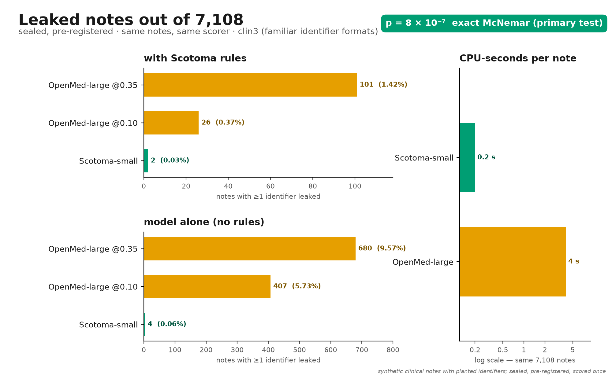
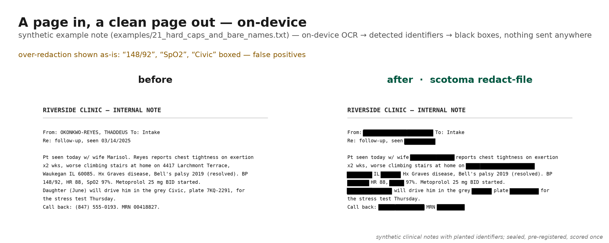

# Scotoma-small

**Support on [Ko-fi](https://ko-fi.com/djlougen) or X Money: [@DJLougen](https://x.com/DJLougen)**

`scotoma-small` is the token classifier inside the Scotoma engine of [Scrub N Paste](https://github.com/DJLougen/scrub-n-paste), an on-device clinical
PHI redaction app for macOS (Tauri + Rust). It is
`microsoft/deberta-v3-small` (141M parameters, 98M of which are the embedding
table) fine-tuned to tag 21 HIPAA Safe-Harbor-style identifier categories, then
exported to ONNX and quantized to per-channel int8.

**Headline (sealed evaluation 3, pre-registered, 7,108 synthetic clinical notes, scored once):**
rules + scotoma-small leaked **2** notes; rules + OpenMed-PII-SuperClinical-Large @0.10 leaked
**26**. Exact two-sided McNemar p = 8.0 × 10⁻⁷. Per note it costs about 20 ms against about
240 ms on a laptop CPU. Details and caveats are [below](#evaluation).

<p align="center"></p>

<p align="center"><br>
<sub>Over-redaction shown as-is: “148/92”, “SpO2” and “Civic” were boxed — false positives on vitals and the car model; every planted identifier was covered.</sub></p>

| | |
|---|---|
| Format | ONNX (`model_quantized.onnx`, per-channel int8, 172 MB; optional fp32, 566 MB) |
| Input | `input_ids`, `attention_mask` — fast tokenizer in `tokenizer.json`, max length 384 |
| Output | `logits` over 43 labels (BIO over 21 categories + `O`) |
| Decision rule | identifier probability = sum of the 42 non-`O` class probabilities; a token is an identifier if that sum ≥ 0.02 |
| Threshold storage | `scotoma_threshold: 0.02`, `scotoma_max_len: 384`, `scotoma_domain: clinical` in `config.json` |
| Latency | ~20 ms per clinical note on an Apple M3 Max CPU (measured through ONNX Runtime) |
| Quantized weights sha256 | `33be24386b0bbdb2758a86087140f7a4a93bd21923a85fe20085bf611ba87e41` |

**Nothing leaves the machine.** In Scrub N Paste this model runs inside a
local ONNX Runtime; there is no network path in the inference code.

## Intended use

- Finding HIPAA Safe-Harbor identifiers in English clinical-style prose, as the
  learned half of a redaction system. Scrub N Paste pairs it with the
  deterministic Scotoma rules engine; the shipped configuration is **rules + this model**, with a
  review screen before anything is copied out.
- Direct ONNX inference in your own pipeline (see below).

**Out of scope / not a substitute for:**

- A guarantee of complete de-identification. It is a helper for a human who
  reviews the output, not an unattended compliance tool. Under 45 CFR
  164.514(a) expert determination, liability is yours.
- Real clinical corpora. Every benchmark number below is on **synthetic**
  notes written by an LLM with planted identifiers. Performance on real
  clinical text (e.g. i2b2/n2c2) has **not** been measured yet.
- Non-English text; handwritten or table-heavy documents.
- Images on their own. The model reads text only. When the app redacts a screenshot, image or PDF,
  it runs on-device OCR first, so OCR misreads carry through.

## How to use

### In Scrub N Paste

[Scrub N Paste](https://github.com/DJLougen/scrub-n-paste) (macOS) bundles this model. Hotkeys: ⌘⌥S redact selection/clipboard, ⌘⌥R
restore originals, ⌘⌥D capture a screen region and redact via on-device OCR,
⌘⌥N blank note, ⌘⌥V dictate. Output renders either as `[CATEGORY_N]` tags or
as realistic stand-ins, and a review screen shows the redacted text before you
copy it. **Open file…** redacts an image or PDF. It writes a new image-only copy with
solid black boxes, and no hidden text layer. A CLI (`scotoma`) exposes the same engine,
including `scotoma redact-file IN OUT`.

### Plain onnxruntime

```python
import json
import numpy as np
import onnxruntime as ort
from tokenizers import Tokenizer

cfg = json.load(open("config.json"))
id2label = {int(k): v for k, v in cfg["id2label"].items()}
THRESH = cfg.get("scotoma_threshold", 0.02)
MAX_LEN = cfg.get("scotoma_max_len", 384)

tok = Tokenizer.from_file("tokenizer.json")
sess = ort.InferenceSession("model_quantized.onnx")

def softmax(x):
    x = x - x.max(-1, keepdims=True)
    e = np.exp(x)
    return e / e.sum(-1, keepdims=True)

def identifier_spans(text):
    enc = tok.encode(text)
    ids, attn = enc.ids[:MAX_LEN], enc.attention_mask[:MAX_LEN]
    logits = sess.run(["logits"], {
        "input_ids": np.array([ids], dtype=np.int64),
        "attention_mask": np.array([attn], dtype=np.int64),
    })[0][0]
    probs = softmax(logits)
    # identifier probability = sum over every non-O class
    n_id_classes = len(id2label) - 1                      # 42 = B-/I- × 21
    score = probs[:, 1:1 + n_id_classes].sum(-1)          # labels 1..42 are the identifiers
    spans = []
    for (s, e), p in zip(enc.offsets[:MAX_LEN], score):
        if s == e:            # special tokens have a zero-width offset
            continue
        if p >= THRESH:
            if spans and s <= spans[-1][1]:   # merge adjacent subword tokens
                spans[-1] = (spans[-1][0], e)
            else:
                spans.append((s, e))
    return spans
```

Raise the threshold for higher precision / lower recall; the shipped default
is 0.02 because a missed identifier costs far more than an extra redaction.

## Labels

BIO tags over 21 categories (43 classes total). The categories are HIPAA
Safe-Harbor identifier classes; `ORG` is a quasi-identifier the app only
redacts in strict mode:

`NAME`, `ADDRESS`, `LOCATION`, `ZIP`, `DATE`, `AGE`, `PHONE`, `FAX`, `EMAIL`,
`SSN`, `MRN`, `PLAN`, `ACCOUNT`, `LICENSE`, `VEHICLE`, `DEVICE`, `URL`, `IP`,
`BIOMETRIC`, `ID`, `ORG`

## Training

| | |
|---|---|
| Base | `microsoft/deberta-v3-small` (MIT) |
| Objective | token classification, BIO, overlapping windows (max len 384) |
| Epochs | 3 |
| Learning rate | 5e-5 |
| Batch size | 32 |
| Seed | 0 |
| Export | `torch.onnx` → per-channel int8 (`model_quantized.onnx`) |

Data (92,273 documents total; manifest `train_v2.manifest.json`, seed 0):

| source | documents | notes |
|---|---|---|
| [nvidia/Nemotron-PII](https://huggingface.co/datasets/nvidia/Nemotron-PII) train | 50,000 | CC BY 4.0, NVIDIA |
| synthetic template notes | 30,000 | generator shipped in the repo (`bench/generate.py`, identifier universe A) |
| LLM-written clinical notes with planted fake identifiers | 12,273 | written by `Qwen/Qwen3-14B-AWQ` (Apache-2.0) around placeholders, training pools only |

The previous shipped model (`v1-small`) used the same recipe with 4,658 planted
clinical notes. Test-pool identifier values and formats are disjoint from all
training pools.

## Evaluation

Method, in one paragraph: identifiers are chosen first from a test-only pool
(universe C, disjoint from training pools); an LLM
(`RedHatAI/diffusiongemma-26B-A4B-it-FP8-dynamic`, Apache-2.0 — a different
family from the training-data generator) writes notes around `[[NAME_1]]`-style
placeholders; a fail-closed verifier substitutes the values so every label is
exact by construction and rejects any note with missing placeholders or an
unplanted-looking identifier. "Novel-format" sets re-draw the structured
identifiers from 56 test-only formats never used in training. Every system is
scored by the same scorer. Metric: **leak-document rate** — share of notes with
at least one identifier left untouched — under the constraint that
**over-redaction** (share of ordinary text redacted) stays ≤ 1%. Sealed sets
are generated first and scored exactly once under a committed pre-registration.

> **Naming:** scotoma-small was called `v2-small` during development. The pre-registrations and logs under
> `bench/results/` (SEALED3_PREREG.md, SEALED3_LOG.md) use that name; it is the same file (sha256 `33be2438…87e41`).

### Sealed evaluation 3 (7,108 notes per set; **this model**, scotoma-small + rules)

A powered re-match vs rules+OpenMed-large@0.1, pre-registered before scoring
(exact two-sided McNemar on per-note leak indicators, α = 0.05; secondary tests
listed in `SEALED3_PREREG.md`). Final, 2026-10-05:

| system | familiar formats (clin3) | novel formats (clin3_novel) |
|---|---|---|
| scotoma-small alone | 4 leaked notes (0.06%) | 3 leaked notes (0.04%) |
| rules + scotoma-small | **2 leaked notes (0.03%)** | **1 leaked note (0.01%)** |
| OpenMed-large @0.1 alone | 407 leaked notes (5.7%) | 210 leaked notes (3.0%) |
| rules + OpenMed-large @0.1 | 26 leaked notes (0.37%) | 33 leaked notes (0.46%) |
| OpenMed-large @0.35 alone (secondary) | 680 leaked notes (9.6%) | 495 leaked notes (7.0%) |
| rules + OpenMed-large @0.35 (secondary) | 101 leaked notes (1.4%) | 140 leaked notes (2.0%) |

- Primary verdict: **significant win** — rules + scotoma-small vs rules + OpenMed-large@0.1 on
  clin3, discordant notes 1 vs 25 (both leaked on 1), exact two-sided McNemar
  p = 8.0 × 10⁻⁷. All secondary comparisons are also significant wins
  (p ≤ 8.0 × 10⁻²⁹).
- Bootstrap CI of the difference: +0.3 percentage points, 95% CI [+0.2, +0.5].
- Over-redaction (must be ≤ 1%): ours 0.1% alone, 0.2% with rules;
  OpenMed-large 0.1–0.3% alone, 0.3–0.5% with rules.
- Latency: ~20 ms/note for scotoma-small vs ~240 ms/note for OpenMed-large on an
  M3 Max CPU; per-note CPU cost measured on a 20-core ARM Linux workstation
  was ~0.2 s vs ~4 s (some sealed-3 runs ran off-Mac at the same commit and
  sha256, with exact dev parity — see `SEALED3_LOG.md`).

Pre-registered dev-set selection (clin2_dev + clin2_novel_dev, rules + model
@0.02): v1-small leaked 6 notes total (4 + 2), v2-small (released as scotoma-small) leaked 2 (2 + 0) with
over-redaction ≤ 0.2% — so it is the "ours" candidate.

<p align="center">
&nbsp;

</p>

<details>
<summary>Per-category recall (clin3, ours vs OpenMed-large@0.10)</summary>


</details>

### Sealed evaluation 2: the full field (860 notes per set; previous model v1-small)

| system | familiar formats, alone | novel formats, alone | + Scotoma rules, familiar | + Scotoma rules, novel | over-redaction | ms/note (CPU) |
|---|---|---|---|---|---|---|
| Scotoma v1-small | 0.6% | 2.6% | 0.2% | 0.2% | 0.1–0.2% | 19 |
| OpenMed-PII-SuperClinical-Large-434M @0.1 | 5.7% | 3.3% | 0.6% | 0.6% | 0.3–0.5% | 240 |
| OpenMed large @0.35 | 9.1% | 7.2% | 1.3% | 1.2% | 0.1–0.3% | 236 |
| OpenMed-PII-SuperClinical-Small-44M @0.02 | 15.2% | – | 0.6% | – | 0.4–0.5% | 19 |
| nvidia/gliner-PII | 29.2% | 25.6% | 2.7% | 3.8% | 0.2–0.4% | n/m |
| knowledgator gliner-pii-edge | 25.7% | 23.5% | 9.4% | 9.1% | 1.6–1.8% | n/m |
| StanfordAIMI/stanford-deidentifier-base @0.1 | 25.3% | – | 5.3% | – | 0.3–0.5% | 27 |
| knowledgator gliner-pii-large | 49.3% | 51.6% | 12.3% | 18.4% | 0.1–0.2% | n/m |
| openai/privacy-filter | 62.4% | 65.3% | 30.1% | 29.1% | 0.3–0.5% | n/m |
| Microsoft Presidio | 72.2% | 74.9% | 43.5% | 53.6% | 1.9–2.0% | n/m |
| knowledgator gliner-pii-base | 72.6% | 75.9% | 38.1% | 41.5% | 1.4–1.7% | n/m |
| ai4privacy english-anonymiser-openpii | 75.5% | 73.7% | 58.1% | 57.0% | 0.1–0.3% | 98 |
| iiiorg/piiranha-v1 | 97.2% | 97.3% | 69.4% | 76.4% | 0.1–0.3% | 92 |
| rules only (no model) | 95.9% | 96.9% | – | – | 0.2% | 0.1 |

(n/m = predictions were precomputed on GPU, so no comparable CPU timing.)

<p align="center"></p>

Verdicts (paired bootstrap 95% CI): statistically tied with
OpenMed-large@0.1+rules (2 vs 5 leaked notes) and with OpenMed-small@0.02+rules
on familiar formats; significantly better than everything else listed. History:
sealed evaluation 1 (874 notes, v0 model) was a significant loss to
OpenMed-large@0.1+rules (1.9%/1.7% vs 0.5%) — that result drove the v1
training-data work.

## Limitations and bias

- **All test text is synthetic.** The clinical notes were written by an LLM
  with planted identifier values. Real-note performance (i2b2/n2c2) is
  unmeasured and may be worse.
- Familiar-format sets reuse the identifier **format** families of the training
  generator (the values are disjoint); novel-format sets exist to correct for
  that — on them the model alone degrades more (v1: 2.6% vs 0.6% alone), which
  is exactly what the rules engine covers.
- Trained on English clinical-style prose; other domains and languages are
  untested. Distribution shift (new identifier formats, OCR noise, tables) can
  raise the leak rate.
- Known false-positive pattern: eponymous clinical terms — e.g. "Babinski
  sign" can be tagged as a NAME. The review screen exists because of cases
  like this.
- Latency was measured on an Apple M3 Max CPU, and per-note CPU cost on a 20-core ARM Linux
  workstation. Other platforms are unmeasured. The app is macOS-only for now.
- **A helper, not a guarantee.** A human must review the output before
  relying on it.

## Licence and attributions

- Model weights released under **Apache-2.0**. Base model
  `microsoft/deberta-v3-small` is MIT-licensed.
- Training data: `nvidia/Nemotron-PII` (CC BY 4.0, © NVIDIA); synthetic
  templates and planted clinical notes generated for this project (generator
  `Qwen/Qwen3-14B-AWQ`, Apache-2.0).
- Benchmark notes generated by `RedHatAI/diffusiongemma-26B-A4B-it-FP8-dynamic`
  (Apache-2.0).
- Competitor models were evaluated for benchmarking only and are not included:
  OpenMed models (Apache-2.0), knowledgator GLiNERs (Apache-2.0),
  nvidia/gliner-PII (NVIDIA Open Model License), openai/privacy-filter
  (Apache-2.0), StanfordAIMI de-identifier (MIT), ai4privacy (MIT), piiranha
  (CC-BY-NC-ND-4.0 — never redistributed), Microsoft Presidio (MIT).

## Citation

```bibtex
@misc{scotoma-small,
  title  = {Scotoma-small: on-device clinical de-identification},
  author = {Daniel Lougen},
  year   = {2026},
  note   = {ONNX, per-channel int8; sha256 33be2438...}
}
```

## Contact

Custom de-identification for your document types and identifier formats, new
domains, on-device ML deployment, and benchmark design — the author is
available for paid work: **[Hugging Face](https://huggingface.co/DJLougen) · [Ko-fi](https://ko-fi.com/djlougen) · [X @DJLougen](https://x.com/DJLougen)**
